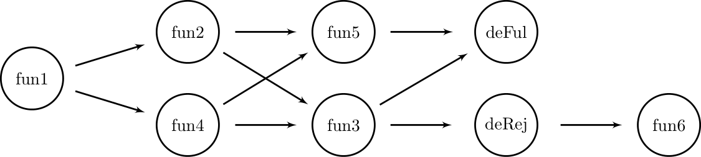

# Async TAJS

This is an extension of TAJS (https://github.com/cs-au-dk/TAJS)
that provides support for asynchronous JavaScript programs.

The details of the extension are described in the
ECOOP'19 paper "Static Analysis for Asynchronous JavaScript Programs".

## How to build and run the tool

Make sure you clone not only the TAJS repository but also the submodules, for example by running
```
git submodule update --init --recursive
``` 

The simplest way to build TAJS is to run Ant:
```
ant
```
This will build two jar files: `dist/tajs.jar` (contains only TAJS itself) and `dist/tajs-all.jar` (includes the relevant extra libraries).

You can now run the analysis as, for example:
```
java -jar dist/tajs-all.jar test-resources/src/google/richards.js
```
or
```
java -jar dist/tajs-all.jar test-resources/src/chromeexperiments/3ddemo.html
```

## Analyzing an asynchronous program

```JavaScript
var t;
function foo() {
    if (TAJS_make('AnyBool')) {
        return Promise.resolve('foo').then(
            function fun2() {
                t = {bar: 1};
                return 'foo';
            }
        ).then(function fun3(value) {
            TAJS_assertEquals(value, 'foo');
            throw 'baz';
        });
    } else {
        return Promise.resolve({
            then: function fun4(res) {
                TAJS_dumpValue('thenable exec');
                t = {bar : 1};
                res('bar');
            }
        });
    }
}


var x = Promise.resolve('bar');
x
    .then(function fun1(value) {
        TAJS_assertEquals(value, 'bar');
        return foo();
    })
    .then(function fun5(value) {
        t.bar; // no error;
        TAJS_assertEquals(value, 'bar');
    })
    .catch(function fun6(value) {
        // This error is propagated from fun3.
        TAJS_dumpValue(value);
    });
```

Analyzing this program with async TAJS produces
the following callback graph:



The `deRej()` and `deFul()` functions are the
default promise-related functions used for promise rejection
and fulfillment respectively,
as described in
[ECMAScript Specification](https://www.ecma-international.org/publications/files/ECMA-ST/ECMA-262.pdf).
